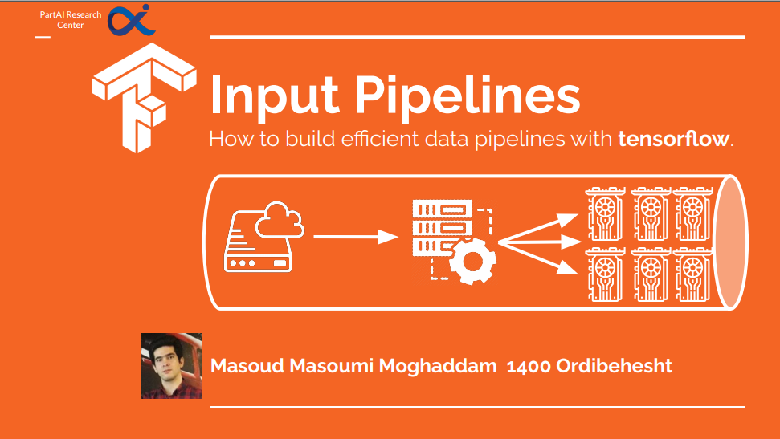

# Digikala-color-classification
This repository is dedicated for a presentation Tensorflow data pipelines which can be found 
[here](TF_data_piplines_slides.pdf)

# Dataset

The dataset can be found in [this](https://www.kaggle.com/masouduut94/digikala-color-classification) kaggle repository.

I recommend you take a look at [slides](TF_data_piplines_slides.pdf) to follow up with latest awesome tools that 
tensorflow has provided to boost up the performance in the training and evaluation pipeline. 

This code implements these tools in tensorflow:
- Extract hsv histogram, use it as features and train sklearn classifiers.
- Use tf.data as data generator and practice some of useful methods.
- Use Tensorboard to track metrics like accuracy, precision, loss, auc-roc curve and etc.
- Save confusion matrix plot and GradCam output (using tf-explain) in tensorboard images to get better insights about models.
- How to apply numpy operations on tf.data using tf.py_function.
- Use albumentations for more strong and professional augmentations.

We will add the following tools soon:
- Custom loop
- tf.snapshot
- tf.data.distribute
- tf.function
- XLA
- Mixed Precision
- Synchronous Training

